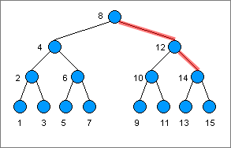

### 인덱스의 의미
> 데이터를 잘 관리하기 위해 사용하는 DBMS에는 내가 원하는 데이터를 빨리 찾을 수 있는 **인덱스** 자료 구조가 있다. 모든 데이터를 일일이 확인하지 않아도 찾고자 하는 데이터를 빨리 찾을 수 있도록 돕는다.

인덱스에는 인덱스의 키와 행 주소에 대한 정보를 담고 있다.  
인덱스의 데이터 위치를 따라가면 원하는 데이터를 쉽게 찾을 수 있다.

### 인덱스와 기본 키의 관계
기본 키는 테이블에서 매우 중요한 정보이므로 DBMS는 기본 키로 지정된 열에 인덱스를 자동으로 만든다.  
```sql
SELECT 사번, 이름, 직위 FROM 직원 WHERE 사번 = 'A002'
```
위와 같은 쿼리문이 들어온다면, 사번에 대한 인덱스가 있기 때문에 DBMS는 인덱스를 먼저 뒤져본다. DBMS는 인덱서의 첫째 행부터 데이터를 비교하며 사번이 A002인 행을 찾는다. (색인에서 단어를 찾기 쉽게 가나다순으로 정렬하는 것처럼 DBMS도 인덱스를 순서대로 정렬한다.)

🚨 하지만, A00002라면 금방 찾겠지만 사번이 A99999이라면 맨 마지막에 가서야 데이터를 찾을 수 있다.
> 더 빨리 찾을 수 있는 방법 중 하나가 **B-Tree 인덱스**이다.

루트 노드, 리프 노드 그리고 그 사이에 있는 브랜치 노드로 이루어져 있다.



찾고자 하는 인덱스가 루트 노드보다 크다면 오른편만 검색한다. 이런 방식으로 범위를 좁혀 나가면서 데이터를 찾기 때문에 시간이 매우 짧아진다.

### 인덱스를 지정하는 방법
DBMS는 모든 열의 인덱스를 자동으로 만들어주지 않는다. 빠른 검색이 필요한 열이 있다면 직접 인덱스를 지정해야 한다. 또한, 인덱스 지정으로 항상 속도가 빨라지는 것은 아니기 때문에 어떤 열을 인덱스로 지정할지 고민해야 한다. 인덱스를 잘못 지정하면 오히려 성능이 나빠질 수 있다.

☝🏻 인덱스를 잘 지정하기 위한 첫 번째 조건은 `유일한 열`이다.  
(주소처럼 긴 문자열을 인덱스로 지정하면 인덱스에 저장되는 데이터의 크기도 덩달아 커져 성능에 부담이 될 수 있다.)