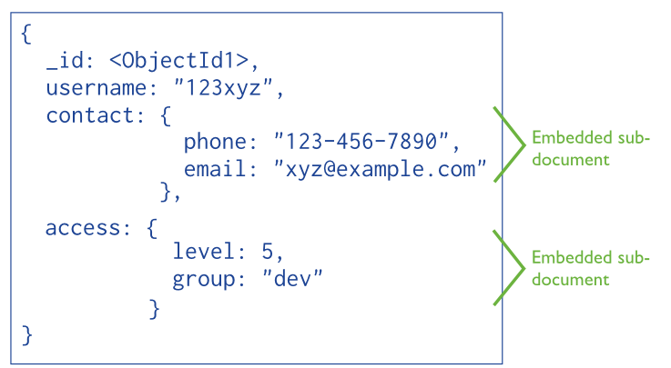

만드는 어플리케이션의 특성에 따라 사용해야 하는 데이터베이스가 다르다.
- 관계형 데이터베이스
  - 개체 무결성, 참조 무결성 등을 DBMS에서 관리하니 데이터가 잘못 들어갈 일이 없다.
  - DBMS에서 제공하는 SQL이라는 특별한 언어를 사용하여 데이터를 쉽게 조작할 수 있다.
  - 하지만, 실시간으로 방대하게 축적되는 비정형 데이터에는 적합하지 않다.
  - 행을 중심으로 읽고 쓰는 행 지향 데이터베이스, 열을 중심으로 읽고 쓰는 열 지향 데이터베이스로 구분되어 있다.
- 키-값 데이터베이스
  - 값(Value)를 보면 다양한 형태의 데이터가 있다. 이를 비정형 데이터라고 한다.
  - 기하급수적으로 축적되는 빅데이터 시대에서 데이터의 형식의 자유로움을 그대로 허용하는 데이터베이스이다.
  - 키와 값으로만 저장하기 때문에 저장 구조가 단순해서 여러 서버에 걸쳐 데이터를 저장하고 처리할 수 있다.
    - 여러 대의 서버를 사용해 수평적으로 확장하는(**scale out**)이 가능한 데이터베이스이다.
  - 고사양의 하드웨어를 요구하지 않아서 구축 비용이 저렴하다.
  - 대표적으로 레디스 등이 있다.
- 문서 기반 데이터베이스
  - 문서 단위로 데이터를 처리한다.
  - 문서를 저장하기 위해 JSON, XML, BSON 등의 형식을 사용한다.
  - 대표적으로 몽고DB 등이 있다.
  - 