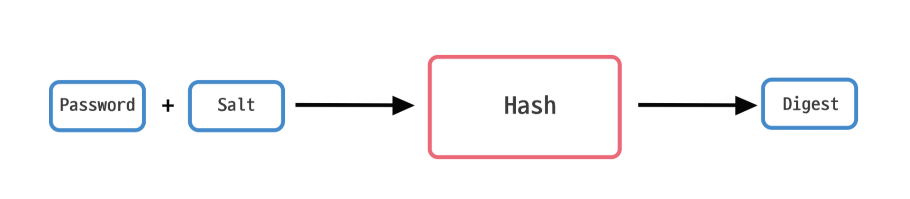

### 단방향 암호화의 특성
- 한쪽으로만 암호화를 하는 방법이다.
- 다양한 길이의 문장을 항상 고정된 길이의 암호문으로 변환하지만, 원래 문장으로 복호화할 수 없다는 특징이 있다.
- 비밀번호 암호화, 문서 진위 여부 검증 등 여러 목적으로 사용된다.
- 단방향 암호화를 위해 **해시 함수**를 사용한다.
  - 입력값 처리 후 출력값을 반환하는 여느 함수와 동일하지만, 이해하기 어려운 문자들로 나열된 문장으로 출력한다는 점이 다르다.

**✅ 단방향 암호화에 해시 함수를 사용하는 이유가 무엇일까요?**
> 1. 비밀번호가 길든 짧든 해시 값은 길이가 동일하기 때문에 해시 값으로는 비밀번호 길이를 유추하기 어렵다. 
> 2. 해시 함수는 동일한 입력값에 대해 항상 동일한 해시 값을 출력한다.
> 3. 입력값이 조금이라도 변경된다면 완전히 다른 해시 값을 출력한다. 
> 4. 해시 값으로는 원래 입력값을 유추할 수 없다. 입력에서 출력으로 향하는 단방향 암호 알고리즘을 사용하기 때문이다.

### 안전한 해시 알고리즘
보통 해시함수는 SHA 알고리즘을 사용한다. SHA-256은 256비트, SHA-512는 512비트의 해시 값을 생성한다. 

**✅ 해시 값의 길이가 짧으면 보안에 어떤 문제가 있을까요?**
> 예를 들어, 해시 함수가 4비트의 고정된 길이를 출력한다고 가정하면, 출력 길이가 4비트이므로 해시 값의 가짓수는 16개이다. 수많은 입력을 16가지 해시 값으로만 표현한다는 것은 보안이 매우 취약하다. 이처럼 길이가 짧은 해시 값은 서로 다른 입력 값에 대해 동일하게 만들어질 가능성이 매우 높다. 해시 충돌을 막기 위해서는 긴 해시 값을 생성하는 해시 함수를 사용해야 한다.

### 해시 함수를 위한 소금, 솔트
해커들은 부지런하게도 다음과 같이 잘 알려진 비밀번호와 이에 대한 해시 값을 데이터베이스로 구축해둔다. 이렇게 입력 값과 해시 값의 쌍이 저장된 데이터베이스를 `레인보우 테이블`이라고 부른다.  
이런 해커들의 공격에 대응하기 위해 해시 함수에 솔트를 사용한다.
> 솔트는 임의 길이의 고정된 난수이다.

비밀번호 + 솔트 값 => 해시 함수
