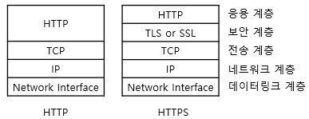

### 보호해야 할 중요한 정보
고유 식별 정보에는 운전면허번호, 여권번호, 외국인등록번호 등이 있다. 소프트웨어를 만들 때 고유 식별 정보를 포함하려면 사용자의 동의를 얻고, 이 정보를 암호화된 형태로 '저장' 및 '전송'해야 한다.

### 알고리즘을 이용해 개인정보 암호화하기
- DBMS에서 제공하는 암호화 기능을 사용하는 방법도 있다.
- 예를 들어, MariaDB의 경우 다음과 같다.
```sql
INSERT INTO 사용자(휴대폰 번호) VALUES (
    AES_ENCRYPT('010-0000-0000', 'dfafdfafdfaefjefjafu32483edeefe')
);
```

### HTTPS를 이용해 통신 구간 암호화하기
**✅ 개인정보는 저장할 때만이 아니라 '전송'할 때도 암호화해야 한다. 왜 전송할 때도 암호화해야 할까요?**
> 인터넷은 남들이 볼 수 있는 공용 망이어서 통신 과정에서 누군가 내 데이터를 훔쳐볼 수 있기 때문이다.

전송할 때 중요한 데이터만 암호화하는 방법도 있지만 서버와 클라이언트 사이에 주고받는 데이터를 전부 암호화하는 방법도 있다. 이를 위해 HTTPS를 사용한다.  
HTTPS는 HTTP over SSL의 약자로 보안이 강화된 HTTP 프로토콜이다.  


**✅ HTTPS에서는 왜 인증서를 사용할까요?**
> 클라이언트와 서버 간의 송수신되는 데이터는 대칭 키 암호 알고리즘을 사용해 암호화한다. 클라이언트가 서버로부터 공개 키를 받아야 하는데, 클라이언트가 받은 공개 키가 진짜가 아니면 문제가 발생한다. 전송 과정에서 해커가 공개 키를 바꿔치기해도 클라이언트는 이 사실을 알아차리지 못하고 해당 키를 사용할 것이다. 따라서, 인증서라는 개념이 등장했다.
- 인증서는 `이 공개 키는 내가 인증하니까 믿고 사용해`라는 의미로 신뢰할 수 있는 인증 기관이 발급한다.
- 과정은 다음과 같다.
  1. 신뢰할 수 있는 기관이 인증 키를 발급한다.
  2. 웹 서버는 인증 서버에서 받은 인증서를 클라이언트에게 보낸다.
  3. 클라이언트는 이 인증서가 진짜인지 검증한다.
  4. 인증서가 진짜이면 인증 기관에서 발급받은 공개 키로 비밀 키를 암호화해서 서버에 보낸다. 
  5. 웹 서버는 개인 키로 비밀 키를 복호화한다.
- 보통 개발 단계에서는 오픈소스인 OpenSSL을 사용해서 인증서를 생성한다.
  - 실제 서비스를 운영할 때는 digicert, verisign 등 인증 기관에서 인증서를 발급받아야 한다.