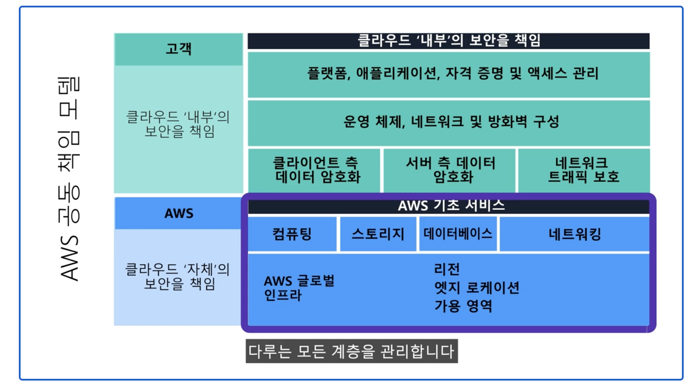

### 개요
- 웹 어플리케이션이 동작하게 하기 위해서 구축할 수 있는 환경
  - 온프레미스 환경
  - 클라우드 환경
    - 클라우드 서비스는 컴퓨팅 자원을 사용자에게 빌려주는 일종의 렌털 서비스이다.
    - 무엇을 빌려주는지에 따라서 서비스 유형이 달라진다.
      - 어플리케이션을 빌려주면 => Software as a Service `SaaS`
      - 플랫폼을 빌려주면 => Platform as a Service `PaaS`
      - 서버, 스토리지 등 인프라를 빌려주면 => Infra-structure as a Service `IaaS`
- 클라우드 서비스를 제공하는 사업자가 다 알아서 할 것 같지만, 꼭 그렇지는 않다. 사업자가 책임지는 영역과 고객이 책임지는 영역을 분리하기 때문이다.
  - 
  - 인프라 영역의 보안은 AWS에서 관리한다. 하지만 플랫폼과 어플리케이션 영역의 보안은 고객인 우리가 직접 관리해야 한다.
> 보안은 소프트웨어 설계할 때부터 시작된다. 그 시점부터 보안을 고려하여 시큐어 코딩을 해야 한다. 보안 취약점이 있는 어플리케이션은 아무리 훌륭한 보안 서비스를 이용하더라도 해커의 공격에 약점을 드러낼 수밖에 없다.

### 다양한 보안 서비스의 세계
클라우드 서비스를 이용하면 방화벽, 웹 방화벽, 침입 방지 시스템(Intrusion Prevention System) 등 다양한 보안 서비스를 이용하게 된다.
- 방화벽
  - AWS의 EC2 서비스는 기본적으로 방화벽 서비스인 Security Group이 서비스된다.
  - IP 주소와 포트를 확인해 트래픽을 차단하거나 허용하는 보안 서비스이다.
  - 기본적으로 모든 트래픽이 막혀있기 때문에 접근을 허용할 IP 주소와 포트를 설정해야 한다.
  - 인바운드, 아웃바운드 규칙으로 서버로 들어오고 나가는 트래픽을 관리한다.
- 웹 방화벽
  - 어플리케이션의 주요 취약점을 공격하려는 시도를 탐지해 차단한다.
  - SQL 인젝션, 크로스 사이트 스크립트 등 주요 취약점을 탐지해 차단하고 직접 필터를 설정해 특정 공격 패킷을 차단한다.
- 침입 방지 시스템
  - 네트워크 수준의 보안 기능이다.
  - 이 시스템을 이용하면 DDoS, SYN 플러딩 등 네트워크 수준의 공격을 탐지하고 차단할 수 있다.

### 데이터를 암호화하는 서비스
- 암호화하려면 별도의 암호화 모듈을 설치해야 하지만, 클라우드 서비스를 이용하면 이조차도 서비스로 암호화할 수 있다.
- AWS에는 AWS Encryption SDK가 있다.
- 이를 이용해 클라우드 스토리지와 데이터베이스에 저장된 데이터를 암복호화할 수 있다.

또한, 데이터를 전송하는 구간도 암호화해야 한다. HTTPS를 직접 설정하고 인증서도 구입해야 한다. 또 주기적으로 인증서를 갱신해야 한다.

### 외부 접근을 최소화하기 위한 인트라넷 서비스
외부 공격으로부터 웹 서버를 보호하기 위해 외부 네트워크에 연결되는 서버를 최소화해야 한다.  
외부와 직접 통신이 필요하지 않는 서버는 일반적으로 인트라넷으로 구성된다.  
(메일 서버, 웹 서버 등은 외부 네트워크와 연결되도록 구성하지만 DB 서버는 별도의 인트라넷으로 구성한다.)

> 클라우드 서비스에는 AWS의 VPC를 사용하여 특정 서버를 VPC안에 위치하도록 구성하여 외부 접근을 막을 수 있다.
