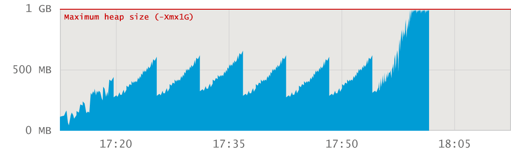

### C를 위한 메모리 관리
운영체제가 CPU, 메모리 등 컴퓨팅 자원을 잘 관리해주니 우리가 코드를 작성하면서 컴퓨터 자원을 다룰 일도 없지만, 자원을 제어할 권한도 주어지지 않는다. 개발자들이 자원을 제어할 수 있는 자원은 메모리이다.

C언어로 메모리를 할당하고 해제할 때는 malloc(), calloc(), free() 함수를 사용한다.
```c
// 10바이트 크기의 동적 메모리를 할당하고 메모리 주소가 반환되면 myMemory에 넣는다. 이후로는 myMemory 변수를 이용해 메모리에 접근한다.
myMemory = (int*)malloc(sizeof(int) * 10);
```

개발자에게 메모리를 할당할 권리가 주어진 만큼 메모리 사용이 끝나면 제대로 반환할 책임도 있다.  
**✅ 메모리 할당을 해제하지 않으면 어떤 문제가 생기나요?**
> 메모리를 할당해놓고 해제하지 않으면 메모리를 불필요하게 계속 점유하기 때문에 메모리 부족 현상이 나타날 수 있다. 가용한 메모리가 부족하면 컴퓨터가 전반적으로 느려지고 추가ㅈㄱ인 메모리 할당도 불가하다.

사용하지도 않는 메모리를 점유하여 다른 프로세스가 사용하지 못게 하는 것을 `메모리 누수`라고 한다.  
메모리 누수 현상이 나타나기 전에 알아차리기 위해서 윈도우의 '성능 모니터'를 참고할 수 있다.  
그래프가 평평하게 유지되거나 메모리 사용량이 올라가더라도 특정 시점에 내려간다면 메모리가 잘 관리되고 있는 것이다. 

### 자바를 위한 메모리 관리
> 자바에서는 메모리 해제 함수가 없어서 개발자가 직접 메모리를 해제하지 못한다. JVM이라는 가상 머신이 메모리를 찾아내 주기적으로 정리한다. 이를 `가비지 컬렉션`이라고 한다.

```java
String data1 = new String("MY DATA");
String data2 = data1;

data1 = null;
```
**✅ 위의 경우에서 data1에 할당된 메모리가 가비지 컬렉션 대상이 되지 않는 이유는?**
> data1 변수에 저장된 주소 값을 data2 변수에 복사해서 여전히 메모리를 참조하기 때문이다.

비쥬얼 VM같은 자원 모니터링 도구로 힙 메모리 크기를 관찰하면, 힙 메모리 사용량이 증가하다가 주기적으로 감소하는 것을 확인할 수 있다.  


### 파이썬을 위한 메모리 관리
파이썬은 `레퍼런스 카운팅`방법을 이용하여 메모리를 관리합니다. 레퍼런스 카운팅은 메모리가 참조되어 사용되면 레퍼런스 카운팅을 1 증가시키고, 그렇지 않으면 1 감소 시키는 방법이다. 레퍼런스 카운팅이 0이 되면 더 이상 참조되지 않는 메모리로 판단하고 해당 메모리 할당을 해제한다.