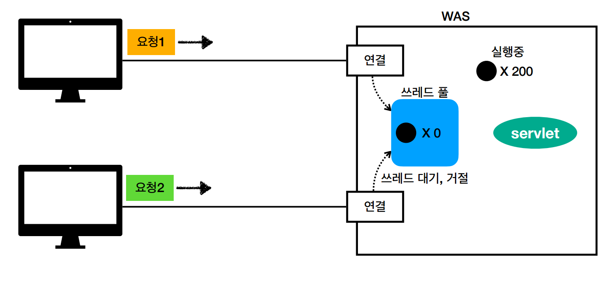
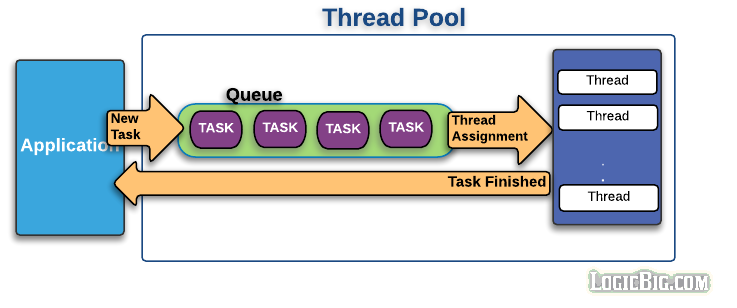

- 프로그램, 프로세스, 스레드의 차이
  - 하드디스크에 저장된 바이너리 코드를 `프로그램`이라고 한다.
  - 메모리에 적재된 프로그램을 `프로세스`라고 부른다. CPU에 의해 실행 중이거나 주기억장치에 적재된 프로그램과 데이터로 정의한다.
  - `스레드`는 프로세스 내부에서 실행되는 흐름의 단위이다.
  - 하나의 프로그램에서 둘 이상의 스레드를 동시에 실행하는 방식을 `멀티 스레드`라고 한다.

**✅ 스레드 풀을 미리 만들어두는 이유는?**
> 작업이 새로 생길 때마다 스레드를 생성하려면 시간이 꽤 걸린다. 작업량에 따라 스레드를 계속 생성하면 자원이 부족해질 수 있어서 무한정 스레드를 생성하지도 못한다. 따라서, 작업량에 따라 그때그때 스레드를 생성하지 않고 스레드 풀을 미리 만들어둔다.

프로그램을 시작할 때 고정된 개수의 스레드를 미리 생성해놓고 풀 형태로 제공한다. 스레드가 이미 생성되었으니 작업을 빨리 할당하고, 컴퓨터 자원의 양을 고려하여 스레드 생성 개수를 제한할 수 있다.

WAS에서 스레드 풀을 사용한다. WAS는 클라이언트로부터 요청이 들어오면 이를 접수하고 대기 큐에 넣는다. 스레드 풀의 요청 처리 스레드가 대기 큐에서 요청을 가져와 처리하는 방식으로 동작한다. 요청이 많아지면, 웹 서버에서는 일부 작업이 처리되지 못해 대기 큐에서 기다리게 되고 클라이언트 입장에서는 웹 서버의 응답 시간이 길어진다고 느끼게 된다.  


**스레드 풀을 설정하는 방법**
- Tomcat같은 WAS의 설정 파일을 변경한다.
```
server:
  tomcat:
    threads:
      max: 200 # 생성할 수 있는 thread의 총 개수
      min-spare: 10 # 항상 활성화 되어있는(idle) thread의 개수
    accept-count: 100 # 작업 큐의 사이즈
```
- 비즈니스 로직으로도 스레드 풀을 설정할 수 있다.
```java
public static void main(String[] args) {
  // 대기 큐 생성
  LinkedBlockingQueue<Runnable> queue = new LinkedBlockingQueue<>(10);
  // 스레드 풀 객체 생성
  ThreadPoolExecutor threadPool = new ThreadPoolExecutor(2, 5, 10, TimeUnits.SECONDS, queue);
  // 스레드 풀에 10개 작업 할당
  for (int i = 0; i < 10; i++) {
    threadPool.execute(new Task());
  }
  threadPool.shutdown();
}
```

**스레드 풀 관리를 위한 옵션들**
- CORE_POOL_SIZE
  - 스레드 풀이 유지할 최소 스레드의 개수이다.
- MAX_POOL_SIZE
  - 최대 스레드 풀의 개수를 설정한다.
- KEEP_ALIVE_TIME
  - KEEP_ALIVE_TIME 시간만큼 지켜보다가 작업 수가 감소하면 스레드 수를 줄인다.

🚨 동시에 많은 요청을 처리하지 못하면 RejectedExecutionException 예외가 발생한다. 대기 큐의 대기 열이 꽉 차서 작업 스레드 개수를 MAX_POOL_SIZE만큼 추가했음에도 요청을 처리하지 못하기 때문이다. 이 문제를 해결하려면 MAX_POOL_SIZE를 증가시켜야 한다. 이처럼 다수 요청을 처리하기 위해서는 `대기 큐의 크기`, `최소 작업 스레드 개수`, `최대 작업 스레드 개수`를 적절하게 설정해야 한다. 대기 큐의 크기를 늘리고 최소 작업 스레드 개수를 줄이면 대기 큐가 가득 차지 않기 때문에 이를 처리할 스레드가 추가되지 않는다. 따라서, 실제 발생할 부하량을 예측하고 적절한 설정 값을 찾는 것이 중요하다.

> DBMS도 스레드 풀을 사용한다. 다수의 어플리케이션이 DBMS 연결을 위해 대기표를 받아 기다려야 하는데, 이때 사용하는 스레드 풀을 커넥션 풀이라고 한다.

